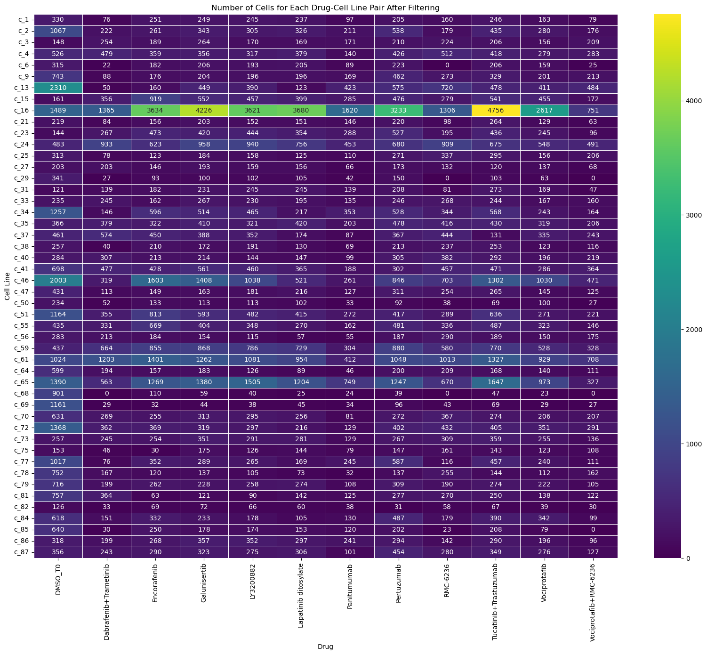

# Data preparation

This folder contains scripts for converting single-cell 
data in the adata format from multiple sources into the MDS format used by our training workflow.

## CellXGene Dataset

Step 1: Download data from CellXGene release into chunks
```shell
python download_cellxgene.py yamls/cellxgene_apr_29_2024.yml
```

(Optionally) Any additional dataset chunks can be added to the same output folder as above 
and they will be merged into the training dataset as long as they have the same columns.

Step 2: Convert h5ad chunks into huggingface dataset format
```shell
python make_dataset.py --adata_dir <ADATA_PATH> --vocab_path <VOCAB_PATH> --output_dir <OUTPUT_PATH>
````
The `--mem-size` flag can be used to limit cache size if running into 
ephemeral storage issues.

Step 3: Merge huggingface dataset chunks into a single dataset
```shell
python concatenate_datasets.py --path <CHUNK_DIR> --dataset_name <DATASET_NAME>
```
The train-test split ratio is hard-coded to 1% in the script. This may be modified if needed.

Step 4: Convert huggingface dataset into MDS format for streaming from S3
```shell
python generate_mds.py --out_root <OUTPUT_PATH> --train_dataset_path <PATH_TO_TRAIN.DATASET> --valid_dataset_path <PATH_TO_VALID.DATASET>
```
The compression parameters and data-field are hard-coded in this script but may be modified if needed.
The output root folder may now be uploaded to S3 and used as a path in the training workflow.

## Vevo Tx - Drug Resistance Dataset

For this task we have considered the drugs screened in the Resistance-if-Futile screen (dataset ID: 35) that 
have a well characterized set of target genes.

The data is processed as follows:
- Preprocessing:
  - Select genes that are present in the MosaicFM vocabulary (matched using Ensemble gene ID, not gene symbol)
  - Select the 5000 most variable genes using Seurat v3 (Note: Seurat v3 expects un-normalized raw counts)
  - Add the 
- Iterate over cell-lines
   - Retrieve cells with drug = "DMSO_TF" as the control group
   - Iterate over drugs that have data in the cell-line (except control)
     - Get the sensitivity from the sensitivity table (growth_rate, growth_rate_bin, growth_rate_mdn)
     - Get the drug-targets from the drug-target table (derived using manual curation)
     - Enumerate cells in that combination (drug, dose, cell-line). Only the highest dose for each drug is selected. 
     - Sample `num_ctrl_samples_to_pair` control cells from the matched control set for the cell-line
     - Store raw counts for the perturbed and control cells for all genes (n_genes=5008)
     - Also record sensitivity, drug-targets, and cell-line information


The heatmap below shows the distribution of drugs and cell-lines in the dataset.



To reproduce the dataset, run the following command:
```shell
python process_mosaic_sensitivity.py yamls/mosaic_resistance_is_futile.yml
```

An example record in the dataset is show below:

```python
{'growth_rate': [0.0259861653678554],
 'growth_rate_mdn': [0.132619704816021],
 'growth_rate_bin': [1],
 'expressions_ctrl_raw': [array([0., 0., 0., ..., 0., 0., 0.], dtype=float32)],
 'expressions_perturbed_raw': [array([0., 0., 0., ..., 0., 0., 0.], dtype=float32)],
 'perturbation_target_genes': [[8304, 8615]],
 'genes': [array([ 9393, 30891,  7312, ..., 50821, 21581, 50771])],
 'cell_line': ['c_38'],
 'drug': ['Lapatinib ditosylate'],
 'cell_key': ['04_06_31-lib_316'],
 'cell_key_ctrl': ['86_32_33-lib_310']}
```

The dataset is then split by the drug-target. We used Galunisertib and LY3200882 as the test-set since they 
both target TGFBR1. This results in a roughly 80-20 split between the train and test sets.

| Dataset                 | Description                                                                                                   | s3 path |
|-------------------------|---------------------------------------------------------------------------------------------------------------|---------|
| Resistance is Futile v1 | Training data tokenized using the vocab for MosaicFM-1.3B. Contains a train and eval split segregated by drug | s3://vevo-ml-datasets/vevo-scgpt/datasets/resistance_is_futile_35_MDS_v1/ |


## PerturbSeq - Adamson et al Dataset

The data is processed as follows:

```shell
python process_perturbseq.py yamls/perturbseq_adamson.yml
```

Example record:
```python
{'depmap_dependency': 1.0,
 'perturbation_edist': 62.28814212111882,
 'perturbation_target_genes': [20254],
 'expressions_ctrl_raw': array([  0.,   0.,   2., ..., 185.,  12., 150.], dtype=float32),
 'expressions_perturbed_raw': array([ 0.,  1.,  1., ..., 56.,  0., 33.], dtype=float32),
 'genes': array([30607, 10954, 12241, ..., 17076, 17079, 17072], dtype=int32),
 'cell_line': 'K562',
 'perturbation_name': 'SLMO2+ctrl'}
```

The DepMap dependency score is used as a proxy for sensitivity to the perturbation.
The e-distance is a measure of the degree of change induced by the perturbation and 
may be seen as a measure of intensity of the signal present in the data.

## PerturbSeq - Norman et al Dataset

The data is processed as follows:

```shell
python process_perturbseq.py yamls/perturbseq_norman.yml
```

Example record:
```python
{'depmap_dependency': [0.0941306056201959],
 'perturbation_edist': 58.21759247789265,
 'perturbation_target_genes': [5338],
 'expressions_ctrl_raw': array([ 0.,  1.,  0., ..., 12.,  0.,  0.], dtype=float32),
 'expressions_perturbed_raw': array([ 0.,  0.,  0., ..., 11.,  0.,  2.], dtype=float32),
 'genes': array([24905, 47418, 29728, ..., 17079, 48327, 48331], dtype=int32),
 'cell_line': 'K562',
 'perturbation_name': 'COL2A1+ctrl'}
```


